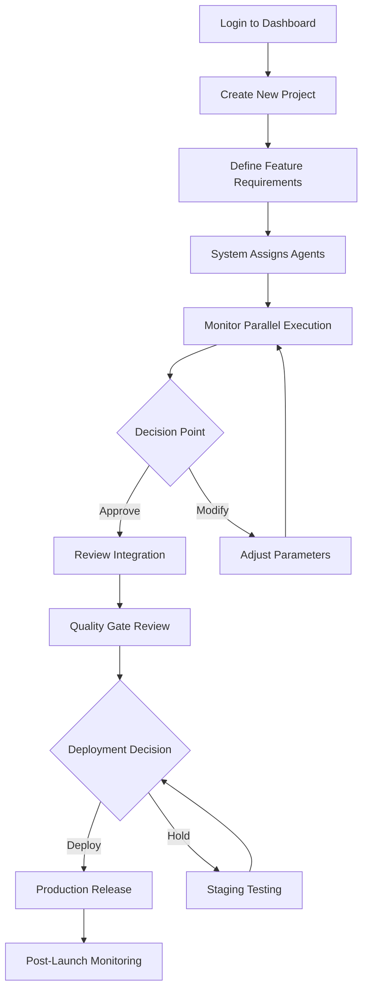
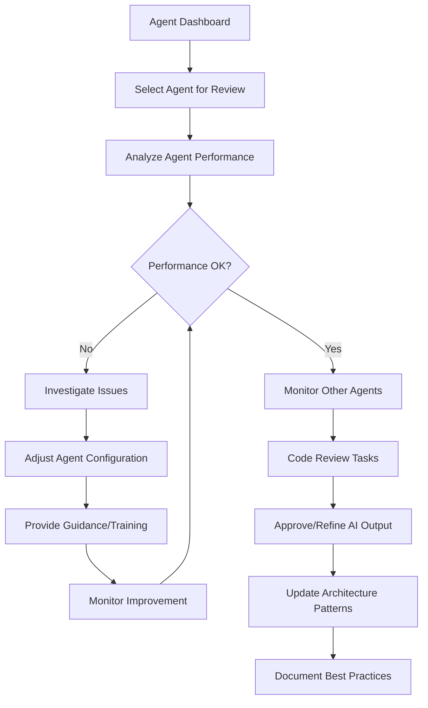
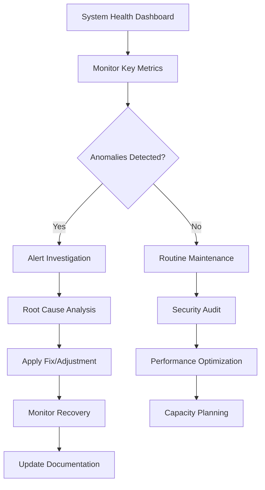

# Claude Code Dev Platform Plugin UX/UI Specification

_Generated on 2025-10-21 by Eduardo Menoncello_

## Executive Summary

### Project Context
The **Claude Code Dev Platform Plugin** is a revolutionary AI-powered development platform designed to achieve 10x development capacity increase through distributed agent architecture. This Level 3 greenfield project transforms traditional development workflows by enabling parallel execution of specialized AI agents, universal tool integration via MCP Adapter Pattern, and intelligent workflow orchestration.

**Platform Vision:** Transform development from manual coding to AI-managed orchestration where human developers focus on strategic decision-making while AI agents handle implementation tasks.

**Technical Stack:** Bun + Elysia + Postgres with pgvector, semantic search, prompt versioning, and real-time collaboration capabilities.

**UX Complexity Analysis:**
- **High Complexity**: Multi-user system with 3 distinct user personas (Development Managers, Senior Developers/AI Managers, Enterprise DevOps Engineers)
- **Advanced Interaction Patterns**: Real-time agent monitoring, workflow orchestration, and strategic AI management interfaces
- **Multi-layered Information Architecture**: Dashboard, agent management, project oversight, and system administration layers
- **Platform Scale**: 73 user stories across 5 strategic epics, indicating comprehensive feature scope

---

## 1. UX Goals and Principles

### 1.1 Target User Personas

**Primary Persona: Development Manager - AI Orchestrator**
- **Background:** Technical manager at scaling SaaS company (5-50 developers) or startup (2-10 developers)
- **Goals:** Accelerate feature delivery, maintain quality oversight, optimize resource allocation
- **Pain Points:** Sequential development bottlenecks, context switching between tools, limited team capacity
- **Technical Comfort:** High - comfortable with dashboards, metrics, and strategic decision tools
- **Success Metrics:** Feature delivery speed, team productivity metrics, quality indicators

**Secondary Persona: Senior Developer - AI Manager**
- **Background:** Experienced developer transitioning to AI management role
- **Goals:** Guide AI agents effectively, review and refine AI-generated code, maintain technical standards
- **Pain Points:** Manual coding limitations, repetitive implementation tasks, maintaining architecture consistency
- **Technical Comfort:** Very High - deep technical knowledge, expects granular control options
- **Success Metrics:** Code quality, architecture consistency, agent productivity

**Tertiary Persona: Enterprise DevOps Engineer**
- **Background:** Infrastructure and platform engineering specialist
- **Goals:** Monitor system health, ensure security compliance, optimize performance
- **Pain Points:** System reliability, monitoring complexity, security and isolation concerns
- **Technical Comfort:** Expert - expects detailed technical controls and comprehensive monitoring
- **Success Metrics:** System uptime, performance metrics, security compliance

### 1.2 Usability Goals

**Primary Usability Objectives:**

1. **Cognitive Load Reduction for Complex Systems**
   - Minimize mental effort required to understand distributed agent operations
   - Provide clear visual hierarchies for multi-agent workflows
   - Reduce decision fatigue through intelligent defaults and contextual assistance

2. **Real-time Situational Awareness**
   - Enable immediate understanding of system state and agent activities
   - Provide proactive notifications for critical events and decision points
   - Support rapid comprehension of workflow progress and bottlenecks

3. **Strategic Decision Support**
   - Present actionable insights rather than raw data
   - Enable quick identification of optimization opportunities
   - Support confident human oversight of AI-driven processes

4. **Error Prevention and Recovery**
   - Prevent costly mistakes through validation and guardrails
   - Enable quick recovery from errors with clear remediation paths
   - Maintain system stability during complex multi-agent operations

5. **Seamless Context Switching**
   - Support rapid movement between different oversight tasks
   - Maintain context awareness across multiple concurrent workflows
   - Enable efficient task management without losing progress

### 1.3 Design Principles

**1. Human-AI Collaboration First**
- Human users maintain strategic control, AI handles execution complexity
- Interfaces should amplify human decision-making, not replace it
- Always provide context for AI actions and enable human intervention

**2. Clarity Through Abstraction**
- Hide implementation complexity while preserving control surface
- Use progressive disclosure to manage information density
- Visualize abstract concepts (agent states, workflows) through concrete metaphors

**3. Predictive and Responsive**
- Anticipate user needs based on workflow context and system state
- Provide proactive guidance for optimal decision points
- Adapt interface based on user expertise and current task

**4. Trust Through Transparency**
- Make AI agent decisions, reasoning, and confidence visible
- Provide clear audit trails for all automated actions
- Enable users to understand and override AI recommendations

**5. Scalable Simplicity**
- Design patterns that work for 1 agent or 50 agents
- Maintain usability consistency as system complexity grows
- Support both simple workflows and complex multi-agent orchestration

---

## 2. Information Architecture

### 2.1 Site Map

**Primary Application Structure:**

```
Dashboard (Root)
├── 🎯 Overview & Strategic Control
│   ├── System Status & Health Metrics
│   ├── Active Workflows Summary
│   ├── Agent Performance Overview
│   └── Quick Actions & Shortcuts
│
├── 🤖 Agent Management Center
│   ├── Active Agents Dashboard
│   ├── Agent Configuration & Settings
│   ├── Agent Communication Logs
│   └── Agent Performance Analytics
│
├── 📋 Workflow Orchestration
│   ├── Active Workflows
│   ├── Workflow Templates Library
│   ├── Workflow History & Audits
│   └── Workflow Builder (Advanced)
│
├── 🏗️ Project Oversight
│   ├── Project Portfolio View
│   ├── Feature Development Pipeline
│   ├── Resource Allocation
│   └── Delivery Analytics
│
├── 🔧 System Administration
│   ├── Configuration Management
│   ├── Integration Settings (MCP Adapters)
│   ├── Security & Access Control
│   └── System Diagnostics
│
└── 📚 Knowledge & Documentation
    ├── Agent Performance Reports
    ├── Workflow Best Practices
    ├── System Documentation
    └── Help & Tutorials
```

**Information Hierarchy Philosophy:**
- **Strategic → Tactical → Operational**: Top-level focuses on business outcomes, mid-level on workflows, detailed level on specific operations
- **Role-Based Access**: Different personas see relevant sections prioritized
- **Progressive Disclosure**: Simple views by default, advanced features on demand

### 2.2 Navigation Structure

**Primary Navigation (Desktop):**
- **Top Navigation Bar**: Logo, Search, User Profile, Notifications
- **Left Sidebar**: Main section navigation with icons + text labels
- **Breadcrumb Trail**: Current location hierarchy for context
- **Quick Actions**: Floating action buttons for common tasks

**Navigation Items by Persona Priority:**

**Development Manager (Primary Focus):**
1. Dashboard Overview
2. Workflow Orchestration
3. Project Oversight
4. Agent Management
5. System Administration
6. Documentation

**Senior Developer (Secondary Focus):**
1. Agent Management
2. Workflow Orchestration
3. Project Oversight
4. Dashboard Overview
5. System Administration
6. Documentation

**DevOps Engineer (Tertiary Focus):**
1. System Administration
2. Agent Management
3. Dashboard Overview
4. Workflow Orchestration
5. Project Oversight
6. Documentation

**Mobile Navigation Strategy:**
- **Bottom Tab Bar**: 4-5 primary sections optimized for thumbs
- **Swipe Gestures**: Quick navigation between related sections
- **Voice Commands**: "Show agent status" for hands-free operation
- **Pull-to-Refresh**: Update real-time data on any screen

**Responsive Navigation Patterns:**
- **Desktop**: Full sidebar with expandable sections
- **Tablet**: Collapsible sidebar with icon-only mode
- **Mobile**: Bottom tabs with hamburger menu for secondary items

**Contextual Navigation:**
- **Smart Shortcuts**: Based on current workflow and user patterns
- **Recent Items**: Quick access to recently viewed agents/workflows
- **Favorites**: User-pinned important items
- **Search-Driven**: Global search with intelligent filtering

---

## 3. User Flows

### 3.1 Journey 1: Development Manager - End-to-End Feature Development

**User Persona:** Development Manager at scaling SaaS company
**User Goal:** Transform a product idea into deployed feature using AI agent orchestration

**Flow Diagram:**


**Detailed Step-by-Step Flow:**

1. **Dashboard Entry & Context**
   - Manager sees system overview with active projects
   - Quick status indicators: agent availability, system health, pending decisions
   - "New Feature" CTA prominently displayed

2. **Feature Definition**
   - Natural language input for feature description
   - AI assists with requirement refinement and clarification
   - Success criteria and constraints definition
   - Priority and timeline setting

3. **Agent Assignment & Strategy**
   - System analyzes requirements and recommends agent team
   - Manager reviews and modifies agent assignments
   - Workflow template selection or customization
   - Resource allocation approval

4. **Parallel Execution Monitoring**
   - Real-time dashboard showing all agent activities
   - Progress indicators, bottleneck identification
   - Communication logs between agents
   - Human intervention points clearly marked

5. **Strategic Decision Points**
   - Architecture approach selection
   - Scope refinement opportunities
   - Quality gate approvals
   - Risk mitigation strategies

6. **Integration & Quality Review**
   - Combined output from all agents displayed
   - Automated test results and quality metrics
   - Performance and security validation
   - Manager approval required for progression

7. **Deployment Control**
   - Staging vs. production deployment decision
   - Rollback strategy confirmation
   - Release timing selection
   - Communication plan setup

8. **Post-Launch Oversight**
   - Performance monitoring dashboard
   - User feedback integration
   - Optimization recommendations
   - Success metrics analysis

**Success Criteria:**
- Feature delivered within target timeline
- Quality standards met
- Team productivity increased
- Manager maintained strategic control throughout

---

### 3.2 Journey 2: Senior Developer - AI Agent Management

**User Persona:** Senior Developer transitioning to AI Manager role
**User Goal:** Effectively guide AI agents and maintain technical standards

**Flow Diagram:**


**Key Interaction Points:**
1. **Agent Performance Analysis**
   - Individual agent metrics and comparison
   - Code quality assessment and trends
   - Communication effectiveness analysis
   - Learning and improvement tracking

2. **Technical Guidance Interface**
   - Code review tools with AI suggestions
   - Architecture pattern validation
   - Best practice recommendations
   - Custom rule and constraint setting

3. **Agent Training & Optimization**
   - Performance feedback mechanisms
   - Custom prompt engineering
   - Knowledge base updates
   - Skill assessment and gap identification

---

### 3.3 Journey 3: DevOps Engineer - System Administration & Monitoring

**User Persona:** Enterprise DevOps Engineer
**User Goal:** Ensure system reliability, security, and optimal performance

**Flow Diagram:**


**Critical Monitoring Points:**
1. **System Health Surveillance**
   - Agent availability and performance metrics
   - Resource utilization and capacity planning
   - Network latency and communication quality
   - Error rates and failure pattern analysis

2. **Security & Compliance Oversight**
   - Agent isolation and sandbox monitoring
   - Access control and authentication audit
   - Data encryption and privacy verification
   - Compliance reporting and documentation

---

### 3.4 Journey 4: Onboarding & First-Time User Experience

**User Persona:** New Development Manager
**User Goal:** Successfully understand and start using the AI development platform

**Flow Stages:**
1. **Welcome & Value Proposition**
   - Interactive platform overview
   - Success story examples and case studies
   - Quick demo of key capabilities

2. **Personalized Setup**
   - Role identification and customization
   - Integration with existing tools (Git repos, CI/CD)
   - Team member invitations and access setup

3. **Guided First Project**
   - Step-by-step workflow for simple feature
   - AI assistance throughout the process
   - Success celebration and next steps

4. **Advanced Feature Discovery**
   - Progressive feature unlock based on usage
   - Personalized recommendations and tips
   - Community and support resources

---

### 3.5 Journey 5: Crisis Management & Error Recovery

**User Persona:** Development Manager during system issues
**User Goal:** Quickly identify, understand, and resolve critical system issues

**Emergency Response Flow:**
1. **Alert & Triage**
   - Real-time notifications with severity levels
   - Quick context summary and impact assessment
   - Immediate recommended actions

2. **Investigation & Diagnosis**
   - Detailed error logs and timeline reconstruction
   - Agent communication analysis
   - System state snapshot and comparison

3. **Resolution & Recovery**
   - Automated rollback options
   - Manual intervention controls
   - System restart and reinitialization

4. **Post-Incident Review**
   - Root cause analysis reporting
   - Prevention strategy development
   - System improvement recommendations

---

## 4. Component Library and Design System

### 4.1 Design System Approach

**Recommended Strategy: Custom Component Library with Foundation Framework**

Given the complexity of distributed agent visualization and the need for unique interaction patterns, I recommend:

1. **Primary Approach**: Custom component library built on **Radix UI** primitives
   - **Why**: Radix provides robust accessibility foundation while allowing complete customization
   - **Benefits**: Full control over unique agent visualization requirements, consistent with technical stack

2. **Base Framework**: **Tailwind CSS** for styling and design tokens
   - **Why**: Aligns with technical stack (Bun/Elysia ecosystem), enables rapid iteration
   - **Benefits**: Utility-first approach, easy design system maintenance, responsive utilities

3. **Animation System**: **Framer Motion** for complex micro-interactions
   - **Why**: Advanced animations needed for agent state transitions and workflow visualizations
   - **Benefits**: Physics-based animations, gesture support, performance optimization

4. **Data Visualization**: **D3.js** + **Recharts** for complex agent performance metrics
   - **Why**: Custom network diagrams, agent relationship visualizations, real-time metrics
   - **Benefits**: Maximum flexibility for unique data presentation needs

**Component Philosophy:**
- **Atomic Design**: Build from smallest elements (buttons, inputs) to complex organisms (agent cards, dashboards)
- **Composability**: Components designed to combine in flexible ways for different contexts
- **Performance-First**: Virtualization for large data sets, lazy loading, optimized re-renders

### 4.2 Core Components

**Foundation Components (Level 1 - Atoms):**

**Interactive Elements:**
- **Button**: 5 variants (primary, secondary, tertiary, danger, ghost) + 3 sizes
- **Input**: Text, email, password, search with validation states
- **Select**: Single/multi select with search, tagging, async options
- **Checkbox/Radio**: Custom styled with accessibility features
- **Toggle**: Switch-style boolean input with smooth transitions
- **Slider**: Range selection with value indicators

**Feedback Components:**
- **Toast**: Notification system with 4 types (success, error, warning, info)
- **Badge**: Status indicators with counts, colors, and animations
- **Progress**: Linear, circular, and step progress indicators
- **Tooltip**: Contextual help with positioning logic
- **Modal**: Multi-purpose dialogs with sizes and animations

**Layout Components (Level 2 - Molecules):**

**Card System:**
- **AgentCard**: Agent status, performance metrics, action buttons
- **WorkflowCard**: Workflow progress, agent assignments, timeline
- **ProjectCard**: Project overview, health metrics, quick actions
- **MetricCard**: KPI display with trends and comparisons

**Navigation Components:**
- **Sidebar**: Collapsible navigation with icons, badges, search
- **Breadcrumb**: Hierarchical navigation with overflow handling
- **Tabs**: Horizontal/vertical tabs with content panels
- **Pagination**: Data table navigation with page size options

**Complex Components (Level 3 - Organisms):**

**Dashboard Components:**
- **MetricsDashboard**: Real-time KPI grid with refresh controls
- **AgentGrid**: Visual agent status grid with filtering and sorting
- **WorkflowCanvas**: Drag-and-drop workflow builder with node connections
- **TimelineView**: Sequential event display with zoom and filter

**Monitoring Components:**
- **SystemHealth**: Overall system status with drill-down capabilities
- **PerformanceChart**: Real-time performance graphs with multiple metrics
- **AlertPanel**: Categorized alerts with severity levels and actions
- **LogViewer**: Searchable, filterable log display with export options

**Specialized Components:**

**Agent Visualization:**
- **NetworkDiagram**: Interactive agent relationship visualization
- **StateDiagram**: Agent state machine visualization with transitions
- **CommunicationFlow**: Message flow between agents with timeline
- **ResourceAllocation**: Visual resource usage and capacity planning

**Data Management:**
- **DataTable**: Virtualized table with sorting, filtering, export
- **CodeEditor**: Syntax-highlighted code display with diff support
- **ConfigEditor**: JSON/YAML configuration editor with validation
- **FileUpload**: Drag-and-drop file handling with progress and preview

**Component Interaction Patterns:**
- **Context Menus**: Right-click actions for all major components
- **Keyboard Shortcuts**: Global shortcuts for power users
- **Bulk Actions**: Multi-select with batch operations
- **Drag & Drop**: File uploads, workflow building, dashboard customization

---

## 5. Visual Design Foundation

### 5.1 Color Palette

**Primary Brand Colors:**
- **Primary Blue**: `#2563EB` (Blue-600) - Primary actions, links, brand identity
- **Primary Dark**: `#1E40AF` (Blue-800) - Hover states, active elements
- **Primary Light**: `#3B82F6` (Blue-500) - Emphasis, highlights

**Secondary Colors:**
- **Accent Purple**: `#7C3AED` (Purple-600) - AI-related features, agent states
- **Success Green**: `#059669` (Emerald-600) - Success states, completed workflows
- **Warning Amber**: `#D97706` (Amber-600) - Warning states, attention needed
- **Error Red**: `#DC2626` (Red-600) - Error states, critical issues

**Neutral Palette:**
- **Gray-50**: `#F9FAFB` - Background, subtle borders
- **Gray-100**: `#F3F4F6` - Card backgrounds, secondary backgrounds
- **Gray-200**: `#E5E7EB` - Borders, dividers
- **Gray-300**: `#D1D5DB` - Disabled elements, subtle text
- **Gray-500**: `#6B7280` - Secondary text, icons
- **Gray-700**: `#374151` - Primary text, headings
- **Gray-900**: `#111827` - Dark mode text, emphasis

**Agent State Colors (Specialized):**
- **Agent Active**: `#10B981` (Emerald-500) - Running, healthy agents
- **Agent Idle**: `#6B7280` (Gray-500) - Waiting, inactive agents
- **Agent Error**: `#EF4444` (Red-500) - Failed, unhealthy agents
- **Agent Learning**: `#8B5CF6` (Violet-500) - Training, optimizing agents
- **Agent Communicating**: `#06B6D4` (Cyan-500) - Message exchange

**Semantic Usage:**
- **Status Indicators**: Use agent state colors for consistency
- **Data Visualization**: Sequential color palette for charts (Blue, Purple, Green, Amber, Red)
- **Interactive Elements**: Primary color hierarchy with clear hover/active states
- **Accessibility**: 4.5:1 contrast ratio for all text/background combinations

### 5.2 Typography

**Font Families:**
- **Primary**: `Inter` - Modern, highly readable sans-serif for UI text
- **Monospace**: `JetBrains Mono` - Code, technical data, system information
- **Display**: `Inter Display` - Headings, large text (optional weight variants)

**Type Scale:**
```
Text Sizes and Line Heights:
- xs:      12px / 16px  - Labels, metadata, timestamps
- sm:      14px / 20px  - Secondary text, captions
- base:    16px / 24px  - Body text, primary content
- lg:      18px / 28px  - Large body text, emphasis
- xl:      20px / 28px  - Small headings, card titles
- 2xl:     24px / 32px  - Section headings
- 3xl:     30px / 40px  - Page headings
- 4xl:     36px / 44px  - Dashboard titles, main headers
- 5xl:     48px / 56px  - Hero titles, special emphasis
```

**Font Weights:**
- **Normal**: 400 - Body text, paragraphs
- **Medium**: 500 - Emphasis, secondary headings
- **Semibold**: 600 - Headings, important text
- **Bold**: 700 - Strong emphasis, navigation
- **Extrabold**: 800 - Heavy emphasis, display

**Typography Hierarchy:**
- **H1**: `4xl / Semibold` - Page titles
- **H2**: `3xl / Semibold` - Section titles
- **H3**: `2xl / Semibold` - Card titles, subsections
- **H4**: `xl / Medium` - Small headings, labels
- **Body**: `base / Normal` - Primary content
- **Small**: `sm / Normal` - Secondary text, metadata
- **Caption**: `xs / Normal` - Labels, timestamps

### 5.3 Spacing and Layout

**Spacing Scale (Tailwind-based):**
```
Space Units:
- 1: 4px   - Micro spacing (padding inside buttons, icon spacing)
- 2: 8px   - Small spacing (between related items)
- 3: 12px  - Medium spacing (form elements, card padding)
- 4: 16px  - Standard spacing (section spacing)
- 6: 24px  - Large spacing (between sections)
- 8: 32px  - Extra large spacing (page layout)
- 12: 48px - Component separation
- 16: 64px - Page margins, major sections
```

**Layout Grid System:**
- **Container**: Max-width 1440px, centered with responsive margins
- **Grid Columns**: 12-column grid for complex layouts
- **Gutters**: 24px (6 space units) between columns
- **Breakpoints**: Mobile (640px), Tablet (768px), Desktop (1024px), Wide (1280px)

**Component Spacing Standards:**
- **Card Padding**: 24px (6 space units)
- **Form Field Spacing**: 16px (4 space units) vertical
- **Button Padding**: 12px horizontal, 8px vertical (3x2 space units)
- **List Item Padding**: 12px vertical, 16px horizontal
- **Section Separation**: 48px (12 space units) vertical

**Layout Patterns:**
- **Dashboard Grid**: CSS Grid with responsive columns
- **Sidebar Layout**: Fixed 256px sidebar, flexible main content
- **Card Layout**: Flexbox for consistent alignment
- **Modal Layout**: Centered with max-width, responsive height

**White Space Strategy:**
- **Breathing Room**: Generous spacing around complex data visualizations
- **Visual Hierarchy**: Use spacing to establish information hierarchy
- **Density Control**: Allow users to adjust dashboard density
- **Responsive Adaptation**: Reduce spacing on mobile for content priority

---

## 6. Responsive Design

### 6.1 Breakpoints

**Responsive Breakpoint Strategy:**
```
Mobile First Approach:
- Base: 0px - 639px   (Mobile portrait)
- sm:   640px - 767px  (Mobile landscape)
- md:   768px - 1023px (Tablet)
- lg:   1024px - 1279px (Desktop)
- xl:   1280px - 1535px (Wide desktop)
- 2xl:  1536px+        (Ultra-wide)
```

**Breakpoint Philosophy:**
- **Mobile First**: Core functionality available on all screen sizes
- **Progressive Enhancement**: Additional features and complexity added as screen size increases
- **Content Priority**: Essential information always visible, secondary features adapt

### 6.2 Adaptation Patterns

**Mobile Adaptations (639px and below):**
- **Navigation**: Bottom tab bar with 4-5 primary sections
- **Dashboard**: Single column layout with collapsible cards
- **Data Tables**: Horizontal scroll with row expansion for details
- **Charts**: Simplified versions with touch-optimized interactions
- **Modals**: Full-screen overlays to maximize content area
- **Forms**: Single column, larger touch targets (44px minimum)

**Tablet Adaptations (768px - 1023px):**
- **Navigation**: Collapsible sidebar with icon-only mode option
- **Dashboard**: Two-column layout with responsive grid
- **Multi-tasking**: Support for split-screen workflows
- **Charts**: Full-featured with touch gestures
- **Context Menus**: Long-press activation with touch-friendly options

**Desktop Adaptations (1024px and above):**
- **Navigation**: Full sidebar with text labels and icons
- **Dashboard**: Multi-column grid with drag-and-drop arrangement
- **Multi-window**: Support for multiple workflow panels
- **Keyboard Navigation**: Full keyboard accessibility and shortcuts
- **Advanced Features**: All functionality available with hover states

**Cross-Device Consistency:**
- **Design Language**: Consistent visual design across all breakpoints
- **Functionality**: Core features available on all devices
- **Data Sync**: Real-time synchronization across device sessions
- **Performance**: Optimized loading and interaction for each context

---

## 7. Accessibility

### 7.1 Compliance Target

**Primary Target: WCAG 2.1 Level AA**
- **Why**: Ensures accessibility for users with disabilities while maintaining design flexibility
- **Scope**: All user-facing interfaces and interactions
- **Compliance Areas**: Visual, auditory, motor, and cognitive accessibility

**Additional Standards:**
- **Section 508**: U.S. federal accessibility requirements for enterprise customers
- **EN 301 549**: European accessibility standards for international compliance
- **ADA Considerations**: Americans with Disabilities Act compliance for legal requirements

### 7.2 Key Requirements

**Visual Accessibility:**
- **Color Contrast**: 4.5:1 for normal text, 3:1 for large text (18pt+)
- **Focus Indicators**: Highly visible focus states with 2px minimum outline
- **Text Scaling**: Support 200% zoom without loss of functionality
- **Color Independence**: Information not conveyed by color alone
- **Motion Preferences**: Respect prefers-reduced-motion for animations

**Motor Accessibility:**
- **Touch Targets**: Minimum 44px × 44px for interactive elements
- **Keyboard Navigation**: Full keyboard access to all functionality
- **Timing Controls**: Users can pause, stop, or extend time limits
- **Error Prevention**: Confirmations for irreversible actions
- **Gesture Alternatives**: Touch gestures have keyboard/button alternatives

**Cognitive Accessibility:**
- **Clear Navigation**: Consistent navigation patterns and labels
- **Error Messages**: Clear, actionable error descriptions
- **Content Structure**: Logical heading hierarchy and organization
- **Instructions**: Clear instructions for complex interactions
- **Help and Support**: Context-sensitive help and documentation

**Screen Reader Support:**
- **Semantic HTML**: Proper heading structure, lists, and landmarks
- **ARIA Labels**: Descriptive labels for complex components
- **Live Regions**: Dynamic content changes announced appropriately
- **Image Alternatives**: Meaningful alt text for all images
- **Form Validation**: Clear announcement of validation errors

**Testing Requirements:**
- **Automated Testing**: Axe DevTools integration in CI/CD pipeline
- **Manual Testing**: Keyboard-only navigation and screen reader testing
- **User Testing**: Include users with disabilities in testing process
- **Documentation**: Accessibility guide for development team

**Agent Accessibility Considerations:**
- **Agent Status**: Screen-readable descriptions of agent states and activities
- **Workflow Progress**: Clear announcements of workflow stage changes
- **Alert Systems**: Accessible notifications with appropriate priority levels
- **Control Interfaces**: Fully accessible agent management and configuration tools

---

## 8. Interaction and Motion

### 8.1 Motion Principles

**Animation Philosophy:**
Animations should enhance understanding of complex agent interactions, not decorate unnecessarily. Every motion serves a specific purpose in making distributed AI operations more comprehensible.

**Core Principles:**

1. **Purpose-Driven Motion**
   - Every animation clarifies system state, relationships, or changes
   - No decorative animations that distract from critical information
   - Motion should guide attention to important events and decisions

2. **Performance-First**
   - 60fps target for all animations
   - Hardware acceleration via CSS transforms and opacity
   - Reduced motion support for users with vestibular disorders

3. **Agent State Communication**
   - Use motion to communicate agent activities and state changes
   - Visualize communication flows between agents
   - Show progress and completion of complex workflows

### 8.2 Key Animations

**Agent State Transitions:**
- **Agent Activation**: Smooth fade-in with subtle scale (0.95 → 1.0) over 300ms
- **State Changes**: Color transitions with 200ms duration, easing `ease-out`
- **Error States**: Quick pulse (2x over 400ms) with red accent, then sustained highlight
- **Communication Flow**: Animated particles between agents showing message exchange

**Workflow Visualizations:**
- **Progress Indicators**: Linear progress with smooth continuous updates
- **Completion Success**: Brief celebration animation (confetti-like particles, 1s duration)
- **Connection Lines**: Animated path drawing between connected workflow nodes
- **Decision Points**: Highlighting animation to draw attention to required human input

**Data Updates:**
- **Real-time Metrics**: Smooth number transitions when values change
- **Chart Updates**: Animated bar/line transitions over 500ms duration
- **Status Changes**: Slide and fade transitions for status card updates
- **Alert Notifications**: Slide-in from right with bounce easing, auto-dismiss after 5s

**Interaction Feedback:**
- **Button Click**: Subtle scale down (0.98 → 1.0) over 150ms with haptic feedback on mobile
- **Card Selection**: Lift effect with shadow increase and border highlight
- **Drag & Drop**: Ghost opacity during drag, snap-to-position on drop
- **Hover States**: Smooth color and shadow transitions over 200ms

---

## 9. Design Files and Wireframes

### 9.1 Design Files

**Design Tool Strategy:**
Given the technical complexity and need for developer handoff, I recommend:

**Primary Design Tool: Figma**
- **Why**: Comprehensive component libraries, advanced prototyping, excellent developer handoff
- **Component Library Setup**: Atomic design system with variants and auto-layout
- **Design Tokens**: Centralized design token management for consistency
- **Developer Handoff**: Inspect panel, code generation, version history

**File Structure:**
```
Claude Code Platform Design System/
├── 🎨 Design Tokens/
│   ├── Colors, Typography, Spacing, Shadows
│   └── Component States (Hover, Active, Disabled)
├── 🧩 Component Library/
│   ├── Atoms (Buttons, Inputs, Icons)
│   ├── Molecules (Cards, Forms, Navigation)
│   └── Organisms (Dashboards, Modals, Layouts)
├── 📱 Screen Designs/
│   ├── Dashboard (Desktop, Tablet, Mobile)
│   ├── Agent Management Interface
│   ├── Workflow Orchestration
│   └── System Administration
└── 🎭 Prototypes/
    ├── User Flow Demonstrations
    ├── Interactive Component States
    └── Mobile Interaction Patterns
```

### 9.2 Key Screen Layouts

**Screen 1: Main Dashboard (Desktop)**
```
┌─────────────────────────────────────────────────────────────┐
│ Header: Logo | Search | Notifications | User Profile        │
├─────────────┬───────────────────────────────────────────────┤
│             │  🎯 System Overview (KPI Cards)               │
│             ├───────────────────────────────────────────────┤
│             │  🤖 Active Agents Grid (4x2 layout)           │
│   Sidebar   ├───────────────────────────────────────────────┤
│ Navigation  │  📊 Workflow Progress Timeline                 │
│   - Dashboard ├───────────────────────────────────────────────┤
│   - Agents   │  ⚡ Quick Actions & Recent Activity          │
│   - Workflows├───────────────────────────────────────────────┤
│   - Projects │  📈 Performance Metrics Chart                 │
│   - Admin    │                                               │
│             │                                               │
└─────────────┴───────────────────────────────────────────────┘
```

**Screen 2: Agent Management Interface**
```
┌─────────────────────────────────────────────────────────────┐
│ Agent Management | Filter | Search | Bulk Actions          │
├─────────────────┬───────────────────────────────────────────┤
│                 │  Agent: "Frontend Dev Agent"              │
│   Agent List    │  ┌─────────────────────────────────────┐  │
│ (Scrollable)    │  │ Status: ● Active | Performance: 92% │  │
│ • Agent 1 ●     │  │ [Configure] [Monitor] [Logs] [Stop]  │  │
│ • Agent 2 ●     │  └─────────────────────────────────────┘  │
│ • Agent 3 ○     │                                           │
│ • Agent 4 ⚠     │  Real-time Metrics:                      │
│                 │  ┌─────────────────────────────────────┐  │
│                 │  │ Response Time Chart                  │  │
│                 │  │ Task Completion Rate                 │  │
│                 │  │ Communication Log                    │  │
│                 │  └─────────────────────────────────────┘  │
└─────────────────┴───────────────────────────────────────────┘
```

**Screen 3: Mobile Dashboard (Bottom Navigation)**
```
┌─────────────────────────────────┐
│ ☰ Menu  📊 Dashboard  👤 Profile│
├─────────────────────────────────┤
│                                 │
│  🎯 System Health               │
│  ● 3 Agents Active              │
│  ⚠ 1 Decision Required          │
│                                 │
│  📈 Quick Stats                 │
│  ┌─────┬─────┬─────┐           │
│  │ 92% │ 8.2s│  15 │           │
│  │Perf │ Lat │Tasks│           │
│  └─────┴─────┴─────┘           │
│                                 │
│  🔄 Recent Activity             │
│  • Feature X completed          │
│  • Agent Y needs review         │
│  • System health check OK       │
│                                 │
├─────────────────────────────────┤
│ 🏠 Dashboard | 🤖 Agents | 📋 Workflows | ⚙️ Settings │
└─────────────────────────────────┘
```

---

## 10. Next Steps

### 10.1 Immediate Actions

**Design Team Next Steps:**
1. **Figma Design System Setup** (Week 1)
   - Establish design tokens and component library
   - Create core component variants and states
   - Set up auto-layout and component properties

2. **Key Screen Prototyping** (Week 2)
   - Create high-fidelity mockups for dashboard, agent management, and mobile views
   - Build interactive prototypes for user testing
   - Establish developer handoff documentation

3. **User Testing & Validation** (Week 3)
   - Test core workflows with target users
   - Validate agent interaction patterns
   - Refine based on feedback

**Development Team Preparation:**
1. **Frontend Architecture Setup**
   - Initialize Tailwind CSS configuration
   - Set up Radix UI integration
   - Establish component library structure

2. **Technical Implementation Planning**
   - Plan data visualization architecture (D3.js/Recharts)
   - Set up animation framework (Framer Motion)
   - Establish accessibility testing pipeline

### 10.2 Design Handoff Checklist

**Design Deliverables:**
- [ ] Complete Figma component library with all variants
- [ ] Design token documentation and export
- [ ] Interactive prototypes for user testing
- [ ] Mobile-first responsive design specifications
- [ ] Accessibility compliance documentation

**Technical Specifications:**
- [ ] Component API documentation
- [ ] Animation specifications and timing values
- [ ] Responsive breakpoint definitions
- [ ] Color palette with semantic usage guidelines
- [ ] Typography scale and spacing system

**Testing Requirements:**
- [ ] Cross-browser compatibility testing plan
- [ ] Accessibility testing (screen readers, keyboard navigation)
- [ ] Performance testing for animations and data visualization
- [ ] Mobile device testing on various screen sizes
- [ ] User testing with personas from target groups

**Development Handoff:**
- [ ] Figma developer handoff with inspect panel access
- [ ] Component implementation order and dependencies
- [ ] Integration requirements with backend systems
- [ ] Real-time data visualization specifications
- [ ] Error state and edge case handling documentation

---

## Appendix

### Related Documents

- PRD: `/docs/PRD.md`
- Epics: `/docs/epics.md`
- Tech Spec: *To be created by architecture workflow*
- Architecture: *To be created by architecture workflow*
- Product Brief: `/docs/product-brief.md`

### Version History

| Date     | Version | Changes               | Author        |
| -------- | ------- | --------------------- | ------------- |
| 2025-10-21 | 1.0     | Initial specification | Eduardo Menoncello |